# Plasma Marketing Metrics

[](https://github.com/xkonjin/plasma-marketing-metrics/actions/workflows/ci.yml)
[](https://opensource.org/licenses/MIT)

> **Unified Marketing Analytics Stack** — An end-to-end, minimal-friction analytics platform that consolidates marketing metrics from Social Media, SEO, PR, and Web Analytics into a single source of truth.

## 📋 Overview

Plasma Marketing Metrics is a modern, open-source marketing data stack designed to help marketing teams centralize their metrics from multiple platforms. It provides a blueprint for building a complete analytics infrastructure using best-in-class open source and managed tools.

## ✨ Key Features

- **📊 Multi-Platform Data Ingestion**
  - X (Twitter) & LinkedIn via Typefully API
  - TikTok analytics via Apify
  - SEO metrics from Semrush
  - Web analytics from Google Analytics 4
  - PR/Brand mentions via Brandwatch (optional)

- **🏗️ Modern Data Stack**
  - Supabase (Postgres) as the data warehouse
  - dbt for data transformations
  - Metabase for business intelligence
  - GitHub Actions for orchestration

- **🔄 Automated Workflows**
  - Scheduled nightly data ingestion
  - Automated dbt model runs
  - Weekly Slack digests
  - Monthly Notion reports

- **🛡️ Production-Ready**
  - Idempotent data ingestion
  - Upsert-based deduplication
  - Exponential backoff for API retries
  - Environment-based configuration

## 🏛️ Architecture

### High-Level System Architecture

```mermaid
flowchart TB
    subgraph DataSources["📡 Data Sources"]
        X["X (Twitter)<br/>Typefully API"]
        LI["LinkedIn<br/>Typefully API"]
        TT["TikTok<br/>Apify"]
        SEM["Semrush<br/>SEO API"]
        GA4["Google Analytics 4"]
        BW["Brandwatch<br/>(Optional)"]
    end

    subgraph Ingestion["🔄 Ingestion Layer"]
        PythonJobs["Python Ingestion Jobs"]
        Airbyte["Airbyte Cloud<br/>(Optional)"]
    end

    subgraph Warehouse["🏭 Data Warehouse"]
        Supabase[("Supabase Postgres")]
        subgraph Schema["📁 Schema"]
            Raw["Raw Data"]
            Staging["Staging Tables"]
            Marts["Data Marts (KPIs)"]
        end
    end

    subgraph Transform["⚙️ Transformation"]
        dbt["dbt Models"]
    end

    subgraph BI["📈 Visualization"]
        Metabase["Metabase Cloud"]
        Dashboards["Marketing Dashboards"]
    end

    subgraph Reporting["📢 Reporting"]
        Slack["Weekly Slack Digest"]
        Notion["Monthly Notion Report"]
    end

    X --> PythonJobs
    LI --> PythonJobs
    TT --> PythonJobs
    SEM --> PythonJobs
    GA4 --> Airbyte
    BW --> Airbyte
    
    PythonJobs --> Raw
    Airbyte --> Raw
    
    Raw --> dbt
    dbt --> Staging
    dbt --> Marts
    
    Marts --> Metabase
    Metabase --> Dashboards
    
    Marts --> Slack
    Marts --> Notion
```



### Data Flow Diagram


## 🛠️ Tech Stack

| Component | Technology | Purpose |
|-----------|------------|---------|
| **Warehouse** | Supabase (Postgres) | Managed Postgres database |
| **BI Tool** | Metabase Cloud | Dashboards & visualizations |
| **Transformations** | dbt | SQL-based data modeling |
| **Orchestration** | GitHub Actions | Workflow scheduling |
| **Ingestion** | Python 3.11+ | API data extraction |
| **Optional ETL** | Airbyte Cloud | GA4 & Brandwatch sync |

## 📁 Repository Structure

```
plasma-marketing-metrics/
├── .github/
│   └── workflows/           # CI/CD automation
│       ├── ci.yml           # Validation workflow
│       ├── ingestion.yml    # Nightly data ingestion
│       └── dbt.yml          # Nightly transformations
├── infra/
│   └── schema.sql           # Database schema definition
├── ingestion/               # Python ingestion modules
│   ├── config.py            # Centralized configuration
│   ├── db.py                # Database connection utilities
│   ├── http.py              # HTTP client with retries
│   ├── typefully.py         # X/LinkedIn ingestion
│   ├── semrush.py           # SEO data ingestion
│   ├── tiktok_apify.py      # TikTok data via Apify
│   ├── ga4.py               # GA4 Reporting API
│   └── brandwatch.py        # PR mentions (optional)
├── scripts/                 # CLI entry points
│   ├── fetch_x.py
│   ├── fetch_linkedin.py
│   ├── fetch_semrush.py
│   ├── fetch_tiktok.py
│   └── fetch_ga4.py
├── dbt/                     # dbt project
│   ├── dbt_project.yml
│   ├── packages.yml
│   ├── profiles.yml
│   └── models/
│       ├── staging/
│       └── marts/
├── reporting/               # Report generation
│   ├── weekly_digest.py     # Slack summaries
│   └── monthly_report.py    # Notion documents
├── docs/
│   ├── metabase-setup.md
│   └── airbyte-setup.md
├── Makefile                 # Common commands
├── requirements.txt         # Python dependencies
└── .env.example            # Environment template
```

## 🚀 Quick Start

### Prerequisites

- Python 3.11+
- Supabase account (free tier works)
- Metabase Cloud account
- API keys for your data sources

### 1. Clone & Setup

```bash
# Clone the repository
git clone https://github.com/xkonjin/plasma-marketing-metrics.git
cd plasma-marketing-metrics

# Create virtual environment and install dependencies
make setup
```

### 2. Configure Environment

```bash
# Copy environment template
cp .env.example .env

# Edit .env with your credentials
# Required variables:
# - DATABASE_URL (Supabase connection string)
# - TYPEFULLY_API_KEY
# - SEMRUSH_API_KEY
# - APIFY_TOKEN
# - GA4_JSON_KEY_B64
```

### 3. Initialize Database

```bash
# Apply schema to Supabase
psql $DATABASE_URL -f infra/schema.sql
```

### 4. Connect Metabase

1. Open your Metabase Cloud workspace
2. Add a new database connection
3. Use your Supabase connection string
4. Verify tables are visible

### 5. Run Ingestion

```bash
# Load environment variables
source .venv/bin/activate
export $(grep -v '^#' .env | xargs)

# Run individual ingesters
python scripts/fetch_x.py --since-days 7
python scripts/fetch_linkedin.py --since-days 7
python scripts/fetch_semrush.py --domain example.com --since-days 7
python scripts/fetch_tiktok.py --handle plasma --since-days 7
python scripts/fetch_ga4.py --since-days 7

# Or use Make targets
make ingest-social   # X + LinkedIn
make ingest-seo      # Semrush
make ingest-tiktok   # TikTok
make ingest-ga4      # Google Analytics
```

### 6. Run Transformations

```bash
# Install dbt and run models
make dbt

# Or manually:
export DBT_PROFILES_DIR=$(pwd)/dbt
dbt deps --project-dir dbt
dbt run --project-dir dbt
```

### 7. Build Dashboards

Open Metabase and create dashboards using the models in `dbt/models/marts/`.

## 🔐 Environment Variables

Create a `.env` file with the following variables:

| Variable | Required | Description |
|----------|----------|-------------|
| `DATABASE_URL` | ✅ | Postgres connection string for Supabase |
| `TYPEFULLY_API_KEY` | ✅ | Typefully API key for X/LinkedIn |
| `SEMRUSH_API_KEY` | ✅ | Semrush API key |
| `APIFY_TOKEN` | ✅ | Apify API token for TikTok |
| `GA4_JSON_KEY_B64` | ⚠️ | Base64-encoded GA4 service account JSON |
| `BRANDWATCH_USERNAME` | ❌ | Brandwatch username (optional) |
| `BRANDWATCH_PASSWORD` | ❌ | Brandwatch password (optional) |
| `SLACK_WEBHOOK_URL` | ❌ | Slack webhook for weekly reports |
| `NOTION_TOKEN` | ❌ | Notion integration token |

## 📝 Usage Examples

### Fetch X Metrics (Last 7 Days)

```bash
python scripts/fetch_x.py --since-days 7
```

### Fetch SEO Data for Specific Domain

```bash
python scripts/fetch_semrush.py --domain example.com --since-days 30
```

### Run All Ingestion Jobs

```bash
make ingest-social && make ingest-seo && make ingest-tiktok
```

### Generate Weekly Report

```bash
python reporting/weekly_digest.py --channel #marketing
```

## 🔄 GitHub Actions CI/CD

The repository includes automated workflows:

| Workflow | Trigger | Purpose |
|----------|---------|---------|
| `ci.yml` | Push/PR to main | Validate Makefile and structure |
| `ingestion.yml` | Nightly cron | Run all ingestion jobs |
| `dbt.yml` | Nightly cron | Run dbt transformations |

### Required GitHub Secrets

Add these secrets in your repository settings:

- `DATABASE_URL`
- `TYPEFULLY_API_KEY`
- `SEMRUSH_API_KEY`
- `APIFY_TOKEN`
- `GA4_JSON_KEY_B64`

## 🛡️ Safety & Idempotency

This stack is designed for safety and reliability:

- **✅ Idempotent Ingestion**: Safe to re-run without duplicates
- **🔄 Upsert Logic**: Key-based deduplication prevents data duplication
- **⚡ Resilient HTTP**: Exponential backoff and retries for all API calls
- **🔒 Environment Isolation**: Separate configs for dev/staging/prod

## 🤝 Contributing

We welcome contributions! Please follow these guidelines:

1. **Fork the repository** and create your branch from `main`
2. **Install development dependencies**: `make setup`
3. **Make your changes** with clear, descriptive commit messages
4. **Test your changes** locally before submitting
5. **Submit a Pull Request** with a detailed description

### Development Workflow

```bash
# Create a feature branch
git checkout -b feature/my-feature

# Make changes and test
make ingest-social

# Commit with conventional commits
git commit -m "feat: add TikTok video engagement metrics"

# Push and create PR
git push origin feature/my-feature
gh pr create --title "feat: add TikTok video engagement" --body "..."
```

### Code Style

- Follow PEP 8 for Python code
- Use type hints where applicable
- Add docstrings to all functions
- Keep functions focused and small

## 📄 License

This project is licensed under the MIT License - see the [LICENSE](LICENSE) file for details.

## 🙏 Acknowledgments

- [Supabase](https://supabase.com) for the managed Postgres platform
- [dbt](https://www.getdbt.com) for the transformation framework
- [Metabase](https://metabase.com) for the BI visualization layer
- [Typefully](https://typefully.com) for the social media API
- [Apify](https://apify.com) for the TikTok scraping infrastructure

## 📞 Support

For questions or support:

- Open an [Issue](https://github.com/xkonjin/plasma-marketing-metrics/issues)
- Check the [docs/](docs/) directory for setup guides
- Review existing [Discussions](https://github.com/xkonjin/plasma-marketing-metrics/discussions)

---

<p align="center">
  Built with ❤️ for marketing teams who love data
</p>
